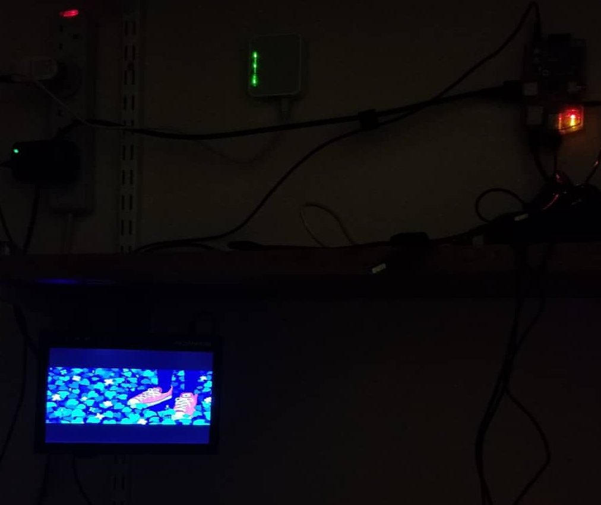

# choonmachine
Tiny bash script to automate shuffle-play on my CCTV monitor.

The program connects to my web server via SSH and starts to randomly play through a folder of music videos I have stored there. If there is no internet connection, it instead plays through a folder of music videos in offline-storage

There are a few different versions.
- liteCHOON.sh is designed to run from a CLI, which makes the boot time almost 9 times quicker (can be placed in .bashrc for autoplay)
- openchoon.sh is desinged to run from a GUI, and can be placed in autostart for autoplay
- sshCHOON.sh is called by openchoon.sh and contains a few extra GUI-based commands to control window focus and terminal size

[A video of an earlier, much  setup can be seen here.](https://streamable.com/rtfv1 "Streamable")

